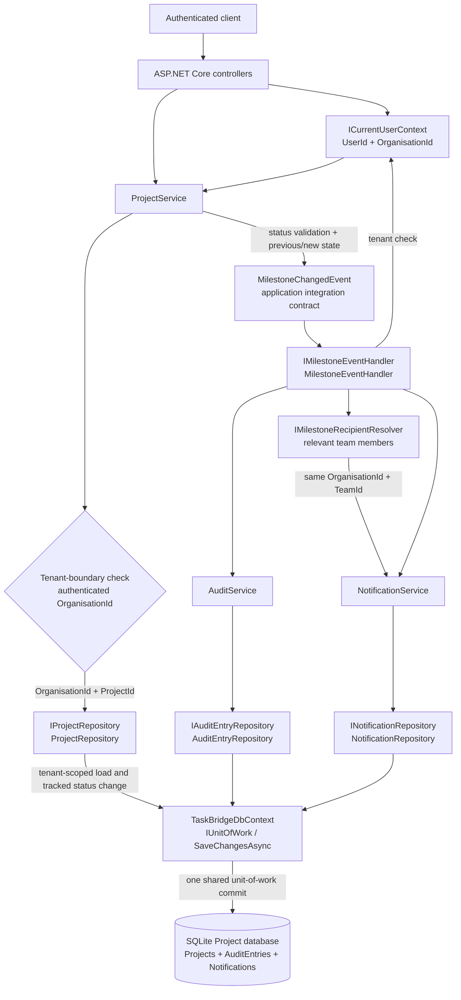

# OTJGHCP
TaskBridge is a multi-tenant B2B SaaS assessment platform for organisation-scoped projects, milestone events, immutable audit history, and team notifications.

## Technology Stack

- .NET 8 and C#
- ASP.NET Core Web API
- Entity Framework Core 8 with SQLite
- FluentValidation
- Serilog-compatible structured logging via `ILogger`
- xUnit and FluentAssertions
- Swagger/OpenAPI

## Prerequisites

- .NET 8 SDK and ASP.NET Core runtime
- `dotnet-ef` 8.0.11 for migration commands
- A shell with the repository root as the working directory

The development container used for verification required:

```bash
export PATH="$HOME/.dotnet:$PATH"
```

## Solution Structure

```text
TaskBridge.sln
├── src/TaskBridge.Api             # Controllers, authentication, composition root
├── src/TaskBridge.Application     # Services, DTOs, validators, abstractions
├── src/TaskBridge.Domain          # Project, AuditEntry, Notification models
├── src/TaskBridge.Infrastructure  # EF Core DbContext, repositories, migrations
├── tests/TaskBridge.Tests         # xUnit behavior tests
└── docs                            # Specifications, reviews, diagrams, evidence
```

## Local Setup

```bash
dotnet restore TaskBridge.sln
dotnet build TaskBridge.sln --no-restore
```

The default SQLite connection is `Data Source=taskbridge.db`. Do not place secrets or real personal data in configuration or example requests.

## Database Migration

Inspect migrations:

```bash
dotnet ef migrations list \
	--project src/TaskBridge.Infrastructure/TaskBridge.Infrastructure.csproj \
	--startup-project src/TaskBridge.Api/TaskBridge.Api.csproj
```

Apply the pending migration during deployment:

```bash
dotnet ef database update \
	--project src/TaskBridge.Infrastructure/TaskBridge.Infrastructure.csproj \
	--startup-project src/TaskBridge.Api/TaskBridge.Api.csproj
```

The verified migration is `AddActorIpAddressToAuditEntries (Pending)` and adds a nullable column. The application currently calls `EnsureCreatedAsync` for the assessment scaffold, so production deployment must establish a migration baseline and apply the migration deliberately rather than relying on startup schema creation.

## Run

```bash
dotnet run \
	--project src/TaskBridge.Api/TaskBridge.Api.csproj \
	--no-build \
	--no-launch-profile \
	--urls http://127.0.0.1:5099
```

The run command was verified with an ephemeral SQLite override:

```bash
ConnectionStrings__TaskBridge='Data Source=:memory:' dotnet run \
	--project src/TaskBridge.Api/TaskBridge.Api.csproj \
	--no-build --no-launch-profile --urls http://127.0.0.1:5099
```

Swagger is available in Development at `/swagger`.

## Test

```bash
dotnet test TaskBridge.sln --no-build --no-restore
```

Verified result: 22 tests passed, 0 failed, and 0 skipped.

## Authentication and Tenant Context

Controllers require authentication. `ICurrentUserContext` obtains `UserId` from `ClaimTypes.NameIdentifier` and `OrganisationId` from the `organisation_id` claim; request bodies must not supply either value. The internal audit POST policy additionally requires the `service_scope=taskbridge.audit.write` claim.

Actor IP metadata comes from server connection context. Forwarded headers are processed only for configured `Network:TrustedProxies`; the default list is empty. The repository currently does not configure issuer, audience, or authority values, so deployment must provide and validate the identity-provider configuration before production use.

## API Endpoints

- `POST /audit` — internal-service audit append; no audit update/delete endpoint exists.
- `GET /audit/{projectId}?from=&to=&eventType=` — organisation-scoped, bounded audit history.
- `GET /notifications/{userId}` — unread notifications for the authenticated user only.
- `PATCH /notifications/{id}/read` — marks the authenticated user’s notification as read.

Example requests use synthetic identifiers and contain no secrets or real personal data:

```bash
curl -X POST http://127.0.0.1:5099/audit \
	-H 'Authorization: Bearer TEST_SERVICE_TOKEN' \
	-H 'Content-Type: application/json' \
	-d '{
		"eventId": "11111111-1111-1111-1111-111111111111",
		"eventType": "MilestoneReopened",
		"entityType": "Milestone",
		"entityId": "22222222-2222-2222-2222-222222222222",
		"projectId": "33333333-3333-3333-3333-333333333333",
		"milestoneId": "22222222-2222-2222-2222-222222222222",
		"previousState": "{\"status\":\"Completed\"}",
		"newState": "{\"status\":\"Active\"}",
		"correlationId": "example-correlation"
	}'

curl -H 'Authorization: Bearer TEST_USER_TOKEN' \
	'http://127.0.0.1:5099/audit/33333333-3333-3333-3333-333333333333?from=2026-09-01T00:00:00Z&to=2026-09-21T00:00:00Z&eventType=MilestoneReopened'

curl -H 'Authorization: Bearer TEST_USER_TOKEN' \
	'http://127.0.0.1:5099/notifications/44444444-4444-4444-4444-444444444444'

curl -X PATCH -H 'Authorization: Bearer TEST_USER_TOKEN' \
	'http://127.0.0.1:5099/notifications/55555555-5555-5555-5555-555555555555/read'
```

## Architecture and Milestone Update Flow



The Project Service owns status business rules and remains independent of EF Core. The event handler coordinates audit append and notification creation through application interfaces, while repositories and `TaskBridgeDbContext` own persistence. Audit entries are append-only; tenant checks use authenticated `OrganisationId` at project, audit, and notification boundaries.

## Important Design Decisions

- Organisation identity is trusted only from authenticated context.
- Audit records are append-only and existing rows remain compatible with nullable actor IP storage.
- Audit snapshots and raw IP addresses are excluded from ordinary audit responses.
- Project, audit, and notification writes share one unit-of-work boundary when they use the same DbContext.
- Reopen is represented by `MilestoneReopened` for `Completed -> Active`.
- Audit query page sizes are bounded and date ranges cannot exceed 90 days.
- Remote notification/audit dispatch requires a transactional outbox and eventual consistency; the outbox is documented but not implemented.

## Limitations and Trade-offs

- Team and team-membership persistence is not present, so project-membership authorization and concrete recipient resolution remain abstractions.
- JWT issuer/audience/service validation is not configured in the repository.
- The assessment uses SQLite and `EnsureCreatedAsync`; production migration deployment must be established separately.
- Concurrent duplicate event delivery can still surface a database uniqueness conflict because check-then-insert is not fully atomic at the application boundary.
- The Project-to-milestone event mapping is temporary because no Milestone aggregate exists yet.
- The 90-day IP retention decision is an assessment engineering decision and requires production privacy/compliance approval.

## Documentation Index

- [Architecture](docs/ARCHITECTURE.md)
- [Technical specification](docs/SPEC.md)
- [Project code review](docs/REVIEW.md)
- [Scope-change impact analysis](docs/IMPACT_ANALYSIS.md)
- [Project event consistency](docs/PROJECT-EVENT-CONSISTENCY.md)
- [Audit IP retention decision](docs/AUDIT-IP-RETENTION.md)
- [PR description](docs/PR_DESCRIPTION.md)
- [Prompt log](docs/PROMPTS.md)
- [Initial generated-code evidence](docs/initial-generated-code/README.md)
